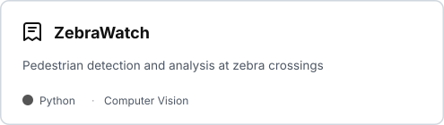

<div align="center">



<a href="https://git.io/typing-svg">
  <picture>
    <source media="(prefers-color-scheme: dark)" srcset="https://readme-typing-svg.demolab.com?font=JetBrains+Mono&weight=500&size=20&duration=3000&pause=900&color=F5F5F5&center=true&vCenter=true&repeat=true&width=900&height=55&lines=Robotics+%2F%2F+3D+Vision+%2F%2F+Embodied+AI;Perception+%E2%86%92+Geometry+%E2%86%92+Control+%E2%86%92+Action;Build+physical+intelligence+for+the+real+world." />
    <source media="(prefers-color-scheme: light)" srcset="https://readme-typing-svg.demolab.com?font=JetBrains+Mono&weight=500&size=20&duration=3000&pause=900&color=222222&center=true&vCenter=true&repeat=true&width=900&height=55&lines=Robotics+%2F%2F+3D+Vision+%2F%2F+Embodied+AI;Perception+%E2%86%92+Geometry+%E2%86%92+Control+%E2%86%92+Action;Build+physical+intelligence+for+the+real+world." />
    
  </picture>
</a>

</div>

---

## TECH_STACK // 技术栈

<div align="center">


</div>

```text
perception_stack : RGB-D · Stereo Vision · Point Cloud · Object Detection
robotics_stack   : Robot Control · Visual Servoing · Hand-Eye Calibration
ai_stack         : PyTorch · VLA · LeRobot · Embodied AI
dev_stack        : Windows · Linux · Git · CUDA
```

---

## CURRENT_FOCUS // 当前方向

- Robot Manipulation / 机器人操作
- 3D Vision & Stereo Vision / 三维视觉与双目视觉
- Visual Servoing / 视觉伺服
- Hand-Eye Calibration & 3D Geometry / 手眼标定与三维几何
- VLA & Embodied AI / 视觉语言动作与具身智能

> **Perception → Geometry → Control → Action**  
> 从感知、几何到控制，让视觉真正进入机器人闭环。

---

## SYSTEM_STATUS // GitHub 状态

<div align="center">
  
  
</div>

---

## PUBLIC_REPOSITORIES // 公开项目

<div align="center">

<a href="https://github.com/white-xr/ShiZi-Fast-FoundationStereo">
  
</a>
<a href="https://github.com/white-xr/orbbec-live-rgb-collector">
  
</a>

<a href="https://github.com/white-xr/-Python-Based-Pedestrian-Detection-and-Analysis-on-Zebra-Crossings">
  
</a>

</div>

---

## HUMAN_LAYER // 柿子本人

```text
alias    : white-xr / 柿子
interest : FPV · Hardware · Robotics
style    : Build it. Test it. Make it work in the real world.
```

代码之外，我更喜欢把视觉、控制、算法和真实硬件接到一起。

---

## CONTRIBUTION_STREAM // 贡献轨迹

<div align="center">
  <picture>
    <source media="(prefers-color-scheme: dark)" srcset="https://raw.githubusercontent.com/white-xr/white-xr/output/github-contribution-grid-snake-dark.svg?v=monochrome-20260909" />
    <source media="(prefers-color-scheme: light)" srcset="https://raw.githubusercontent.com/white-xr/white-xr/output/github-contribution-grid-snake.svg?v=monochrome-20260909" />
    
  </picture>
</div>

---

<div align="center">

`WHITE-XR // ROBOTICS // 3D VISION // EMBODIED AI`

**Build physical intelligence for the real world.**

</div>
