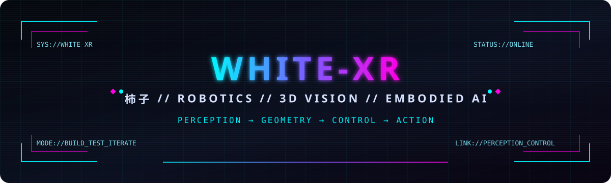

<div align="center">



<a href="https://git.io/typing-svg">
  
</a>

</div>

---

## `> TECH_STACK // 技术栈`

<table>
<tr>
<td valign="top" width="25%">

### `LANG // 语言`


</td>
<td valign="top" width="25%">

### `VISION // 视觉`


</td>
<td valign="top" width="25%">

### `AI // 人工智能`


</td>
<td valign="top" width="25%">

### `ROBOTICS // 机器人`


</td>
</tr>
</table>

```text
> perception_stack : RGB-D · Stereo Vision · Point Cloud · Object Detection
> robotics_stack   : Robot Control · Visual Servoing · Hand-Eye Calibration
> ai_stack         : PyTorch · VLA · LeRobot · Embodied AI
> dev_stack        : Windows · Linux · Git · CUDA
```

---

## `> CURRENT_SIGNAL // 当前方向`

- 🤖 **Robot Manipulation / 机器人操作**
- 👁️ **3D Vision & Stereo Vision / 三维视觉与双目视觉**
- 🎯 **Visual Servoing / 视觉伺服**
- 📐 **Hand-Eye Calibration & 3D Geometry / 手眼标定与三维几何**
- 🧠 **VLA & Embodied AI / 视觉语言动作与具身智能**

> **Perception → Geometry → Control → Action**  
> 从感知、几何到控制，让视觉真正进入机器人闭环。

---

## `> SYSTEM_STATUS // GitHub 状态`

<div align="center">
  
  
</div>

---

## `> PUBLIC_REPOSITORIES // 公开项目`

<div align="center">

<a href="https://github.com/white-xr/ShiZi-Fast-FoundationStereo">
  
</a>
<a href="https://github.com/white-xr/orbbec-live-rgb-collector">
  
</a>

<a href="https://github.com/white-xr/-Python-Based-Pedestrian-Detection-and-Analysis-on-Zebra-Crossings">
  
</a>

</div>

---

## `> HUMAN_LAYER // 柿子本人`

```text
alias    : white-xr / 柿子
interest : FPV · Hardware · Robotics
style    : Build it. Test it. Make it work in the real world.
```

🚁 **FPV** · 🛠️ **Hardware / 硬件** · 🤖 **Robotics / 机器人**

代码之外，我更喜欢把 **视觉、控制、算法和真实硬件** 接到一起。

---

## `> CONTRIBUTION_STREAM // 贡献轨迹`

<div align="center">
  <picture>
    <source media="(prefers-color-scheme: dark)" srcset="https://raw.githubusercontent.com/white-xr/white-xr/output/github-contribution-grid-snake-dark.svg" />
    <source media="(prefers-color-scheme: light)" srcset="https://raw.githubusercontent.com/white-xr/white-xr/output/github-contribution-grid-snake.svg" />
    
  </picture>
</div>

---

<div align="center">

`WHITE-XR // ROBOTICS // 3D VISION // EMBODIED AI`

**正在构建，也正在学习。 / Always building, always learning.**

</div>
